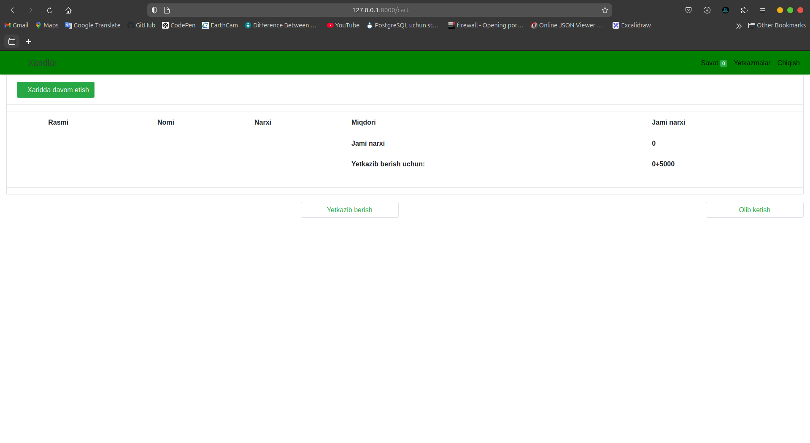

## Online Shoppping Application
#### `1. Register Page`

#### `2. Login Page`

#### `3. Product Page`

#### `4. Cart Page`

#### `5. Orders Page`

## Installation ans Set Up
<pre>git clone https://github.com/theMirmakhmudov/OnlineMarketApplication.git</pre>
<pre>pythom -m venv .venv</pre>
<pre>source .venv/bin/activate</pre>
<pre>pip install -r requirements.txt</pre>
<pre>cp .env-sample .env</pre>
### Migrations
<pre>python3 manage.py makemigrations</pre>
<pre>python3 manage.py migrate</pre>
<pre>python3 manage.py runserver</pre>

### Migrations with Make file
<pre>make make_mig</pre>
<pre>make mig</pre>
<pre>make run</pre>

### Create Super Admin

<pre>python3 manage.py createsuperuser</pre>

### Create Super Admin with Make file

<pre>make admin</pre>
  

<footer>© Copyright 2024 Responsibility Team.</footer>
